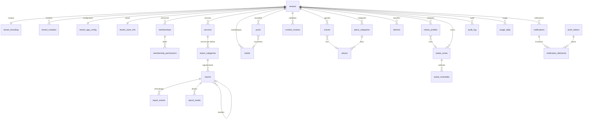

# Base de données (Supabase / Postgres 17 + PostGIS)

Migrations versionnées dans `supabase/migrations/`, une par thème. Tout est dans le schéma `public`
(exposé à l'API, **RLS activée partout**) ; les fonctions internes sont dans `private` (non exposé).

## Commandes

```bash
pnpm db:start      # Supabase local (Docker)
pnpm db:reset      # rejoue toutes les migrations
pnpm db:seed       # données de démonstration (fixtures du mock), personas : Demo-Local-2026!
pnpm db:types      # régénère packages/data/src/supabase/database.types.ts
pnpm db:generate   # régénère les migrations dérivées de TypeScript (enums, données par défaut)
pnpm db:lint       # lint des schémas public et private
pnpm db:test       # tests pgTAP (supabase/tests/database)
```

## Règles de conception

- Chaque table métier : `id uuid` (défaut `gen_random_uuid()`), `tenant_id not null` (sans cascade
  depuis `tenants`), `unique (tenant_id, id)`, `created_at` / `updated_at` (trigger `private.set_updated_at`).
- **Toute référence interne à une commune est une clé étrangère composite** `(tenant_id, x_id)` :
  une ligne ne peut pas pointer vers une donnée d'une autre commune.
- Les `check` reprennent les contraintes zod (longueurs, `https://`, délais, texte alternatif).
- Géographie en `geography(…, 4326)` avec index GIST.
- Enums et données par défaut générés depuis `@app/shared` / `@app/data` (`scripts/db/generated-sql.ts`).
- Cohérence avec zod vérifiée par `packages/data/src/supabase/schema-parity.test.ts`.

### Écarts documentés avec les schémas zod

| zod | base | raison |
|---|---|---|
| `Topic.order`, `Procedure.order` | `sort_order` | `order` est un mot réservé SQL et le paramètre de tri de PostgREST |
| `Event.location` | `location_label` + `location_point` | point indexé en GIST |
| `Media.url` | — | calculée depuis `path` (bucket) par l'adaptateur |
| `Report.photos` | table `report_media` | URLs signées à la lecture |
| `Profile.email`, `lastSignInAt` | `auth.users` | données d'authentification |
| `WasteSchedule.exceptions` | `jsonb` (et non `date[]`) | conserve la date de report |
| `AuditEntry.id` | `uuid` (et non `bigint`) | identifiant commun avec zod |
| — | `notifications.status`, `citizen_profiles.consent_at`, `reports.client_request_id` | propres à la base |

## Fonctions et triggers (`private`)

| Fonction | Rôle |
|---|---|
| `next_counter(tenant, key, year)` | compteur atomique (`insert … on conflict … returning`) |
| `assign_report_reference()` | `before insert` sur `reports` : référence `AAAA-NNNNN` par commune et par année |
| `seed_tenant_defaults(tenant)` | 12 catégories de lieux, 5 de signalement, 1 service, 6 thèmes, 10 modules, `homeLayout`, fiche store ; appelée par `after insert on tenants` |
| `audit_row()` | audit générique (acteur, commune, opération, diff limité aux colonnes modifiées), sans `contact_email` ni `token` |
| `set_updated_at()` | horodatage de modification |

Variables de session utilisées par le seed : `app.skip_tenant_defaults`, `app.skip_audit`.

## Tables

| Thème | Tables |
|---|---|
| Plateforme | `tenants`, `tenant_branding`, `tenant_modules`, `tenant_app_config`, `tenant_store_info` |
| Personnes | `profiles`, `memberships`, `membership_permissions`, `citizen_profiles`, `topics`, `push_tokens` |
| Contenus | `media`, `posts`, `events`, `content_reviews`, `place_categories`, `places`, `procedures`, `sorting_guide_items` |
| Signalements | `services`, `report_categories`, `reports`, `report_media`, `report_events`, `tenant_counters` |
| Territoire | `districts`, `waste_zones`, `waste_schedules` |
| Notifications | `notifications`, `notification_deliveries`, `push_outbox` |
| Audit et usage | `audit_log`, `usage_daily`, `job_runs` |

## Diagramme entités-relations (simplifié)


